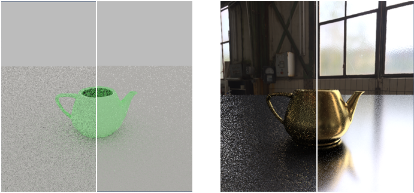

# Path_tracer
Path_tracer is a Path_tracing Off-line Renderer based on Disney principle's PBR material and some of basic noise reduction methods.
Which is implemented by OpenGL and C++.
# OverView

In this object , our workflow is simple scene & simple material --> complex scene & simple material --> complex scene & complex material(low quality) --> complex scene & complex material (high quality).

## part 1. basic ray tracing

In this part, we implemented a basic ray tracing program with  C++ on CPU, then save the final result as a png image.

## part 2. BVH Accelerate Struct
In the last part,we had to go through all the triangles in the scene to get the path's hit result.For accelerate this processing,we implemented the BVH acceletrating structure in this part.Further more,we use SAH algorithm to optimize this structure to make sure the program can work in the scene which has tons of triangles.

 

&emsp;&emsp;&emsp;AABB-Box of BVH with out SAH(left) &emsp;&emsp;&emsp;    AABB-Box of BVH with SAH(right)&emsp; &emsp;&emsp;&emsp; Hit Result
 
## part 3. OpenGL ray tracing

Using OpenGL's fragment shader to run accelerate program. Transfer BVH and triangles in texture buffer, then send to shader. Finally tracing each pixel progressively, then display the dynamic tracing process in screen.

## part 4. disney principle's BRDF

Learning micro facet theory, using Disney principle's BRDF to rendering various of physical material. 

For the low roughness surface, the hemispherical uniform sampling efficiency is very low, so there are many noise points in the image.

## part 5. Importance Sampling & Low Discrepancy Sequence

Methods to denoise, accelerate fitting progress.

Low Discrepancy Sequence (Sobol) :

 

Importance Sampling, diffuse (left) and BRDF (right) :

Importance Sampling for HDR envmap :

Multi Importance Sampling with Heuristic power :

## part 6. Display
 

  

# Requirement

environment:

* Windows 10 x64
* visual studio 2019
* vcpkg
* cmake

C++  lib:

* GLUT (freeglut) >= 3.0.0
* GLEW >= 2.1.0
* GLM  >= 0.9.9.5

Third part cpp lib:

* hdrloader
